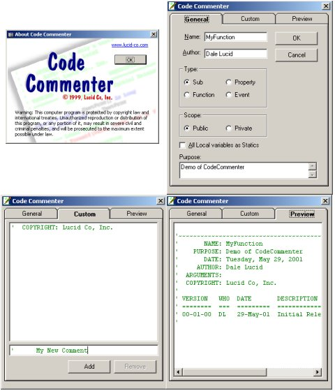



## CodeCommenter

### Description

This VB Add-In helps enforce and customize codeing standards. It works similar to the "Add Procedure" tool in VB but is customized. The program demos the use of the Connection Designer, Creation of VB Add-Ins, the VB IDE, and Resource files.
 
### More Info
 
This code is original code of someone else's idea.

There is a version of CodeCommenter for Access 97 on request.

The Function structure uses a Microsoft API like structure

Comments on generated code refer to an error handleing dll that isn't included. If this code is popular I'll add the error object later.

Feel free to do as you will with this code but if the basic idea remains please give credit where it is due when you redistribute. VOTE IF YOU LIKE IT!

When running the Add-In from the IDE with a second "test" instance of VB you may notice that icons will disappear from VB's toolbar. This is a side effect of running the Add-In uncompiled. When the "Disconnect" code fires the Add-In's toolbar icon is removed. The problem is that the icon doesn't exist in the instance of VB that is running CodeCommenter so the last icon on the toolbar is removed. The more you stop the "test" application the more icons disappear from the first instance of VB. To restore your toolbar simply left click on the toolbar, choose "Customize" then choose "Reset".

             |
---                |---
**Submitted On**   |2001-05-29 09:45:14
**By**             |[Dale E\. Lucid](https://github.com/Planet-Source-Code/PSCIndex/blob/master/ByAuthor/dale-e-lucid.md)
**Level**          |Advanced
**User Rating**    |5.0 (15 globes from 3 users)
**Compatibility**  |VB 5\.0, VB 6\.0, VBA MS Access
**Category**       |[Complete Applications](https://github.com/Planet-Source-Code/PSCIndex/blob/master/ByCategory/complete-applications__1-27.md)
**World**          |[Visual Basic](https://github.com/Planet-Source-Code/PSCIndex/blob/master/ByWorld/visual-basic.md)
**Archive File**   |[CodeCommen202175292001\.zip](https://github.com/Planet-Source-Code/dale-e-lucid-codecommenter__1-23554/archive/master.zip)

